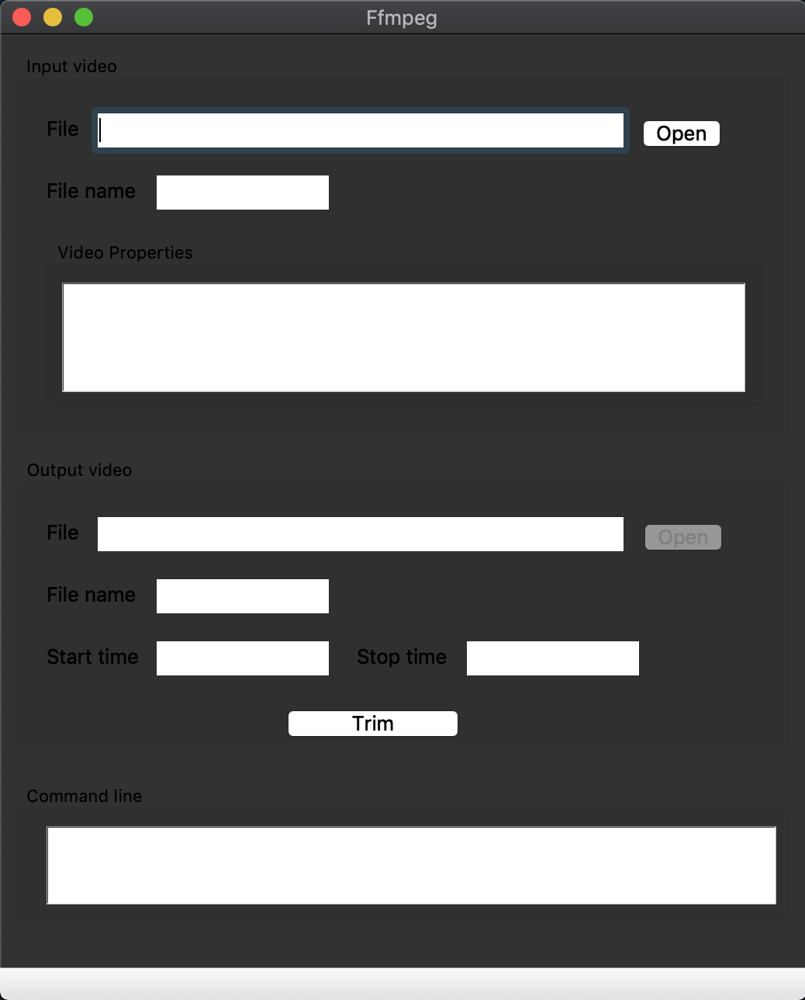

### IHM - laboratory 2
### A GUI for FFMPEG
#### Authors: Samuel Mayor, Alexandra Korukova

#### Objective
The objective of the laboratory is to implement a GUI allowing users
to trim the video using FFMPEG tool.

#### Description

The FFMPEG GUI window contains 3 sections:  
* Input video section  
* Ouput video section  
* Command line section  

The __input video__ section is used to specify the input video file to trim. It contains:
* An "Open" button used to select a video to trim from the disk
* "File" text field, where the input file path is displayed
* "File name" text field, where the name of the selected file is displayed  
* "Video Properties" text area, where the properties of the selected file are displayed

The user can modify the input file name via both "File" and "File name" text fields, they will be automatically synchronized.
If the input video is not valid, a warning will pop up to prevent the user.  
Properties of the selected video are displayed in the "Video Properties" text area.  

The __output video__ section is used to specify the output (trimmed) video options. This section is activated only if the input video file is selected and is valid. It contains:  
* "File" text field used to specify the path to the output video file  
* "File name" text field displaying the output video file name  
* "Start time" and "Stop time" text fields that are used to specify the start and stop time of the output video  
* "Trim" button that launches a FFMPEG command that trims the video  

As for the imput video section, "File" and "File name" text fields are synchronized, so the user can specify the output filename via any of them. "Start time" and "Stop time" are protected with a validator that does not allow to enter the non numerical characters in these text fields. Once the "Trim" button is pressed, start and stop times are checked. If they are not valid (negative, overlapping or bigger than the video duration), the warning is displayed and the trim process is not launched. If the input video file name was modified, the message box will pop up and the user will be asked to confirm the renaming of the input file. If the output file name already exists in the directory, the user will be asked if he prefers to overwrite the existing file.  

Finally, the __command line__ section displays all the FFMPEG shell commands executed by the program.

#### Improvals
Here is the list of the features to implement or improve:
* Remove the "Open" button of the "Output video" section  
* Design of the application: add a layout, make it resizable  
* Improve the rename/overwrite file management  
